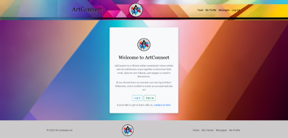

# css-frameworks-ca

A socialmedia app for people to share their art




## Description

css-frameworks-ca is a project aimed at learning JavaScript Bootstrap and SASS, while creating a social media app where people can share pictures of art and receive feedback. The project includes:


- Functional register and login page (if you have a noroff account),with authentication, HTML form validation.
- Profile page displaying your recent posts and images.
- Feed page with list of posts fetched from the api.
- Functional search bar, sort options
- React and comment on users posts

## Built With

- HTML
- CSS
- JS
- Bootstrap: Used for responsive design and UI components.
- SCSS/SASS: Used for styling and organizing CSS code.

## Getting Started

### Installing

clone the repo and install.

1. Clone the repo:

```bash
git clone https://github.com/IceGreenGalactic/css-frameworks-ca.git

2. Install the dependencies:
```

```bash
npm install-D sass
```

```bash
npm install bootstrap@5.3.2
```

```bash
npm install-D live-server
```
```bash
npm install -D copyfiles
```
### Running

To run the app, run the following commands:

```bash
npm run dev
```

## Contact

[My LinkedIn page](https://www.linkedin.com/in/kristine-tyrholm-7902172a4)
[My Portforlio](https://kristine-tyrholm.netlify.app/)


